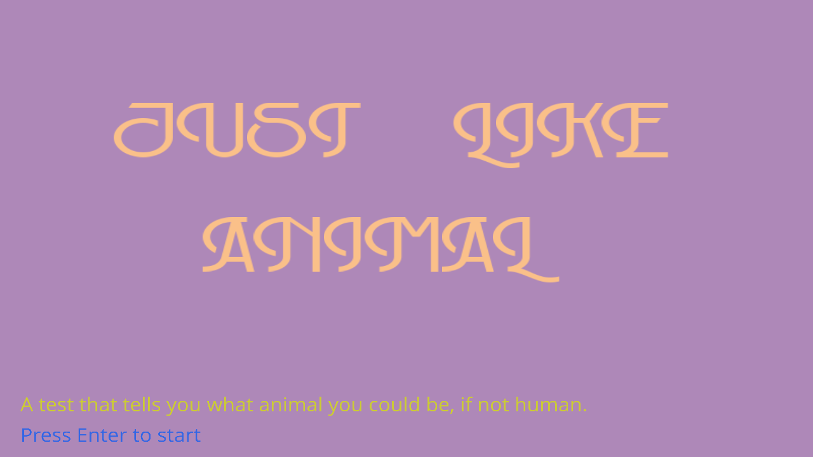

# (TODO: your game's title)

### Author: 

(TODO: your name)

### Design: 

(TODO: In two sentences or fewer, describe what is new and interesting about your game.)

### Text Drawing: 

The text drawing pipeline relies on the following 4 files:  

    TextRenderer.hpp / TextRenderer.cpp 
        These 2 files define a TextRenderer class which takes in a ttf font file and construct a renderer object.
        You can then call renderer.draw(...) to display text.
    TextRenderProgram.hpp / TextRenderProgram.cpp 
        These 2 files define the shader program that is used by the TextRenderer class. 

Some details about the TextRenderer class:  
It uses FreeType to read the ttf font file, and extracts the glyphs from the face (font).  
It uses harfbuzz to shape a user-input text so that we know how to render the glyphs.  
And finally it uses OpenGL to render the glyphs.  
For better performance, durting init, i read all common-used glpyphs (ie. english letters)  
from the face and convert these glyphs into bitmap and store in the buffer.  
A map will store the links between char and the textureID, so that during runtime it directly renders the  
bitmap in buffer using the textureID.   

### Screen Shot:

### How To Play:

(TODO: describe the controls and (if needed) goals/strategy.)

### Sources: (TODO: list a source URL for any assets you did not create yourself. Make sure you have a license for the asset.)

This game was built with [NEST](NEST.md).  
The code is developed from https://github.com/15-466/15-466-f21-base4  
And the text rendering pipeline is based on :  
https://github.com/harfbuzz/harfbuzz-tutorial/blob/master/hello-harfbuzz-freetype.c
https://www.freetype.org/freetype2/docs/tutorial/step1.html
https://learnopengl.com/In-Practice/Text-Rendering
